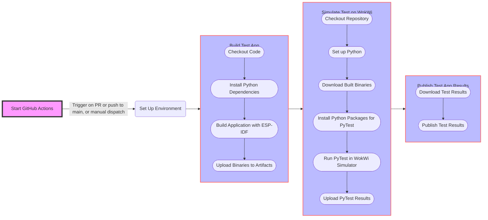
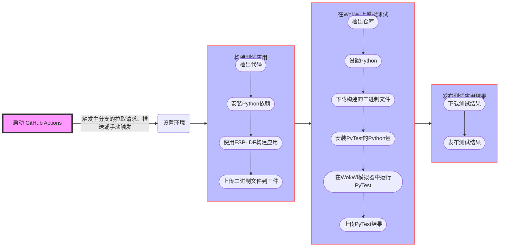

## 流程图（英文）

```mermaid
graph LR
    A[Start GitHub Actions] -->|Trigger on PR or push to main, or manual dispatch| B(Set Up Environment)
    B --> C(Build Test App)

    subgraph C[Build Test App]
        C1([Checkout Code]) --> C2([Install Python Dependencies])
        C2 --> C3([Build Application with ESP-IDF])
        C3 --> C4([Upload Binaries to Artifacts])
    end

    C --> D[Simulate Test on WokWi]

    subgraph D[Simulate Test on WokWi]
        D1([Checkout Repository]) --> D2([Set up Python])
        D2 --> D3([Download Built Binaries])
        D3 --> D4([Install Python Packages for PyTest])
        D4 --> D5([Run PyTest in WokWi Simulator])
        D5 --> D6([Upload PyTest Results])
    end

    D --> E[Publish Test App Results]

    subgraph E[Publish Test App Results]
        E1([Download Test Results]) --> E2([Publish Test Results])
    end

    classDef startNode fill:#f9f,stroke:#333,stroke-width:4px;
    class A startNode;
    classDef subgraphBox fill:#bbf,stroke:#f66,stroke-width:2px,padding:10px;
    class C,D,E subgraphBox;
```

## 流程图（中文）

```mermaid
graph LR
    A[启动 GitHub Actions] -->|触发主分支的拉取请求、推送或手动触发| B(设置环境)
    B --> C(构建测试应用)

    subgraph C[构建测试应用]
        C1([检出代码]) --> C2([安装Python依赖])
        C2 --> C3([使用ESP-IDF构建应用])
        C3 --> C4([上传二进制文件到工件])
    end

    C --> D[在WokWi上模拟测试]

    subgraph D[在WokWi上模拟测试]
        D1([检出仓库]) --> D2([设置Python])
        D2 --> D3([下载构建的二进制文件])
        D3 --> D4([安装PyTest的Python包])
        D4 --> D5([在WokWi模拟器中运行PyTest])
        D5 --> D6([上传PyTest结果])
    end

    D --> E[发布测试应用结果]

    subgraph E[发布测试应用结果]
        E1([下载测试结果]) --> E2([发布测试结果])
    end

    classDef startNode fill:#f9f,stroke:#333,stroke-width:4px;
    class A startNode;
    classDef subgraphBox fill:#bbf,stroke:#f66,stroke-width:2px,padding:10px;
    class C,D,E subgraphBox;

```
